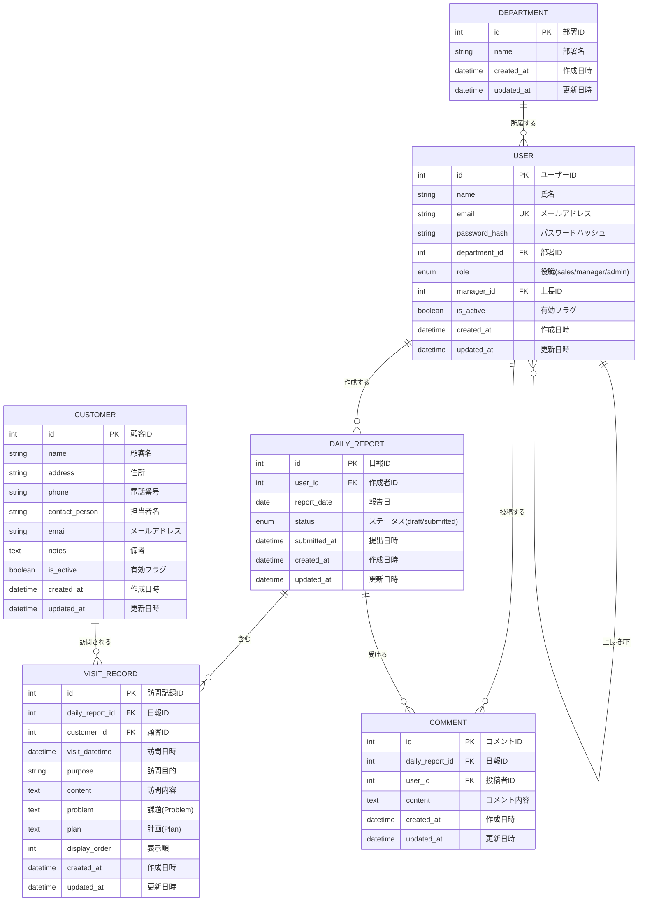

# 営業日報システム ER図

## エンティティ関連図

## テーブル定義

### USER（ユーザー/営業マスタ）

| カラム名 | 型 | NULL | キー | 説明 |
|----------|-----|------|------|------|
| id | INT | NO | PK | ユーザーID（自動採番） |
| name | VARCHAR(100) | NO | | 氏名 |
| email | VARCHAR(255) | NO | UK | メールアドレス |
| password_hash | VARCHAR(255) | NO | | パスワードハッシュ |
| department_id | INT | YES | FK | 部署ID |
| role | ENUM | NO | | 役職（sales/manager/admin） |
| manager_id | INT | YES | FK | 上長のユーザーID |
| is_active | BOOLEAN | NO | | 有効フラグ（デフォルト: true） |
| created_at | DATETIME | NO | | 作成日時 |
| updated_at | DATETIME | NO | | 更新日時 |

### DEPARTMENT（部署）

| カラム名 | 型 | NULL | キー | 説明 |
|----------|-----|------|------|------|
| id | INT | NO | PK | 部署ID（自動採番） |
| name | VARCHAR(100) | NO | | 部署名 |
| created_at | DATETIME | NO | | 作成日時 |
| updated_at | DATETIME | NO | | 更新日時 |

### CUSTOMER（顧客マスタ）

| カラム名 | 型 | NULL | キー | 説明 |
|----------|-----|------|------|------|
| id | INT | NO | PK | 顧客ID（自動採番） |
| name | VARCHAR(200) | NO | | 顧客名 |
| address | VARCHAR(500) | YES | | 住所 |
| phone | VARCHAR(20) | YES | | 電話番号 |
| contact_person | VARCHAR(100) | YES | | 担当者名 |
| email | VARCHAR(255) | YES | | メールアドレス |
| notes | TEXT | YES | | 備考 |
| is_active | BOOLEAN | NO | | 有効フラグ（デフォルト: true） |
| created_at | DATETIME | NO | | 作成日時 |
| updated_at | DATETIME | NO | | 更新日時 |

### DAILY_REPORT（日報）

| カラム名 | 型 | NULL | キー | 説明 |
|----------|-----|------|------|------|
| id | INT | NO | PK | 日報ID（自動採番） |
| user_id | INT | NO | FK | 作成者のユーザーID |
| report_date | DATE | NO | | 報告日 |
| status | ENUM | NO | | ステータス（draft/submitted） |
| submitted_at | DATETIME | YES | | 提出日時 |
| created_at | DATETIME | NO | | 作成日時 |
| updated_at | DATETIME | NO | | 更新日時 |

※ user_id + report_date でユニーク制約

### VISIT_RECORD（訪問記録）

| カラム名 | 型 | NULL | キー | 説明 |
|----------|-----|------|------|------|
| id | INT | NO | PK | 訪問記録ID（自動採番） |
| daily_report_id | INT | NO | FK | 日報ID |
| customer_id | INT | NO | FK | 顧客ID |
| visit_datetime | DATETIME | NO | | 訪問日時 |
| purpose | VARCHAR(200) | NO | | 訪問目的 |
| content | TEXT | NO | | 訪問内容 |
| problem | TEXT | YES | | 課題（Problem） |
| plan | TEXT | YES | | 計画（Plan） |
| display_order | INT | NO | | 表示順 |
| created_at | DATETIME | NO | | 作成日時 |
| updated_at | DATETIME | NO | | 更新日時 |

### COMMENT（コメント）

| カラム名 | 型 | NULL | キー | 説明 |
|----------|-----|------|------|------|
| id | INT | NO | PK | コメントID（自動採番） |
| daily_report_id | INT | NO | FK | 日報ID |
| user_id | INT | NO | FK | 投稿者のユーザーID |
| content | TEXT | NO | | コメント内容 |
| created_at | DATETIME | NO | | 作成日時 |
| updated_at | DATETIME | NO | | 更新日時 |
