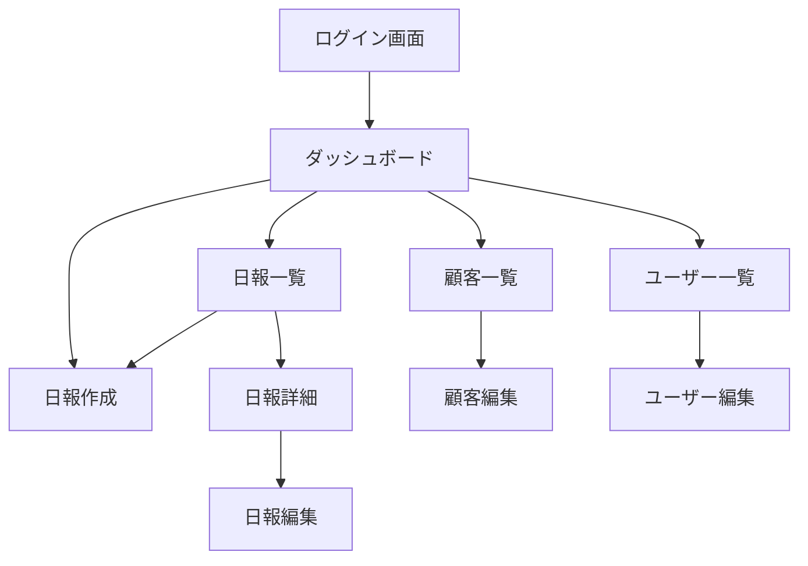

# 営業日報システム 画面定義書

## 1. 画面一覧

| No | 画面ID | 画面名 | 概要 | 権限 |
|----|--------|--------|------|------|
| 1 | LOGIN | ログイン画面 | システムへのログイン | 全員 |
| 2 | DASHBOARD | ダッシュボード | メイン画面、日報サマリー表示 | 全員 |
| 3 | REPORT_LIST | 日報一覧画面 | 日報の一覧表示・検索 | 全員 |
| 4 | REPORT_CREATE | 日報作成画面 | 新規日報の作成 | 全員 |
| 5 | REPORT_EDIT | 日報編集画面 | 日報の編集 | 作成者のみ |
| 6 | REPORT_DETAIL | 日報詳細画面 | 日報の詳細表示・コメント | 全員 |
| 7 | CUSTOMER_LIST | 顧客一覧画面 | 顧客マスタの一覧表示 | 管理者 |
| 8 | CUSTOMER_EDIT | 顧客編集画面 | 顧客情報の登録・編集 | 管理者 |
| 9 | USER_LIST | ユーザー一覧画面 | ユーザー（営業）マスタの一覧 | 管理者 |
| 10 | USER_EDIT | ユーザー編集画面 | ユーザー情報の登録・編集 | 管理者 |

## 2. 画面遷移図



## 3. 各画面レイアウト

---

### 3.1 LOGIN - ログイン画面

```
+--------------------------------------------------+
|                 営業日報システム                   |
+--------------------------------------------------+
|                                                  |
|         +--------------------------------+       |
|         |        ログイン                 |       |
|         +--------------------------------+       |
|         |                                |       |
|         |  メールアドレス                 |       |
|         |  [________________________]    |       |
|         |                                |       |
|         |  パスワード                     |       |
|         |  [________________________]    |       |
|         |                                |       |
|         |       [  ログイン  ]           |       |
|         |                                |       |
|         +--------------------------------+       |
|                                                  |
+--------------------------------------------------+
```

**入力項目:**
| 項目名 | 型 | 必須 | 説明 |
|--------|-----|------|------|
| メールアドレス | text | ○ | ログイン用メールアドレス |
| パスワード | password | ○ | ログイン用パスワード |

---

### 3.2 DASHBOARD - ダッシュボード

```
+------------------------------------------------------------------+
| [ロゴ] 営業日報システム          山田太郎 ▼  [ログアウト]          |
+------------------------------------------------------------------+
| [ダッシュボード] [日報一覧] [顧客管理] [ユーザー管理]              |
+------------------------------------------------------------------+
|                                                                  |
|  +------------------------+  +--------------------------------+  |
|  |  今月の日報            |  |  最近の日報                    |  |
|  +------------------------+  +--------------------------------+  |
|  |  提出済み: 15件        |  |  2026/02/03  提出済み ▶       |  |
|  |  下書き:   2件         |  |  2026/02/02  提出済み ▶       |  |
|  |                        |  |  2026/02/01  下書き   ▶       |  |
|  +------------------------+  +--------------------------------+  |
|                                                                  |
|  +------------------------+  +--------------------------------+  |
|  |  未読コメント          |  |  クイックアクション            |  |
|  +------------------------+  +--------------------------------+  |
|  |  3件の新しいコメント   |  |  [ + 本日の日報を作成 ]       |  |
|  |  ▶ 詳細を見る          |  |                                |  |
|  +------------------------+  +--------------------------------+  |
|                                                                  |
+------------------------------------------------------------------+
```

---

### 3.3 REPORT_LIST - 日報一覧画面

```
+------------------------------------------------------------------+
| [ロゴ] 営業日報システム          山田太郎 ▼  [ログアウト]          |
+------------------------------------------------------------------+
| [ダッシュボード] [日報一覧] [顧客管理] [ユーザー管理]              |
+------------------------------------------------------------------+
|                                                                  |
|  日報一覧                                    [ + 新規作成 ]      |
|                                                                  |
|  +------------------------------------------------------------+  |
|  | 検索条件                                                    |  |
|  | 期間: [2026/01/01] ～ [2026/02/03]                         |  |
|  | 担当者: [全員        ▼]  ステータス: [全て ▼]  [検索]     |  |
|  +------------------------------------------------------------+  |
|                                                                  |
|  +------------------------------------------------------------+  |
|  | 日付       | 担当者   | 訪問件数 | ステータス |  操作      |  |
|  +------------------------------------------------------------+  |
|  | 2026/02/03 | 山田太郎 | 3件      | 提出済み   | [詳細]     |  |
|  | 2026/02/02 | 山田太郎 | 2件      | 提出済み   | [詳細]     |  |
|  | 2026/02/01 | 山田太郎 | 1件      | 下書き     | [編集]     |  |
|  +------------------------------------------------------------+  |
|                                                                  |
|  << < 1 2 3 > >>                                                |
|                                                                  |
+------------------------------------------------------------------+
```

**検索条件:**
| 項目名 | 型 | 説明 |
|--------|-----|------|
| 期間（開始） | date | 検索開始日 |
| 期間（終了） | date | 検索終了日 |
| 担当者 | select | ユーザー選択（上長のみ表示） |
| ステータス | select | 全て/下書き/提出済み |

---

### 3.4 REPORT_CREATE / REPORT_EDIT - 日報作成・編集画面

```
+------------------------------------------------------------------+
| [ロゴ] 営業日報システム          山田太郎 ▼  [ログアウト]          |
+------------------------------------------------------------------+
| [ダッシュボード] [日報一覧] [顧客管理] [ユーザー管理]              |
+------------------------------------------------------------------+
|                                                                  |
|  日報作成                                                        |
|                                                                  |
|  報告日: [2026/02/03]                                            |
|                                                                  |
|  +------------------------------------------------------------+  |
|  | 訪問記録 #1                                      [× 削除]  |  |
|  +------------------------------------------------------------+  |
|  | 訪問日時: [2026/02/03 10:00]                                |  |
|  | 顧客:     [株式会社ABC           ▼]                        |  |
|  | 訪問目的: [定期訪問________________]                        |  |
|  | 訪問内容:                                                   |  |
|  | +--------------------------------------------------------+ |  |
|  | | 新製品の提案を行った。担当者の反応は良好。              | |  |
|  | +--------------------------------------------------------+ |  |
|  | 課題(Problem):                                              |  |
|  | +--------------------------------------------------------+ |  |
|  | | 予算確保が課題。来期予算での検討となる見込み。          | |  |
|  | +--------------------------------------------------------+ |  |
|  | 計画(Plan):                                                 |  |
|  | +--------------------------------------------------------+ |  |
|  | | 来月に再度訪問し、来期予算申請のサポートを行う。        | |  |
|  | +--------------------------------------------------------+ |  |
|  +------------------------------------------------------------+  |
|                                                                  |
|  [ + 訪問記録を追加 ]                                            |
|                                                                  |
|  [ 下書き保存 ]  [ 提出 ]  [ キャンセル ]                        |
|                                                                  |
+------------------------------------------------------------------+
```

**入力項目:**
| 項目名 | 型 | 必須 | 説明 |
|--------|-----|------|------|
| 報告日 | date | ○ | 日報の対象日 |
| 訪問日時 | datetime | ○ | 訪問した日時 |
| 顧客 | select | ○ | 顧客マスタから選択 |
| 訪問目的 | text | ○ | 訪問の目的 |
| 訪問内容 | textarea | ○ | 訪問の詳細内容 |
| 課題(Problem) | textarea | | 発見した課題 |
| 計画(Plan) | textarea | | 今後のアクションプラン |

---

### 3.5 REPORT_DETAIL - 日報詳細画面

```
+------------------------------------------------------------------+
| [ロゴ] 営業日報システム          山田太郎 ▼  [ログアウト]          |
+------------------------------------------------------------------+
| [ダッシュボード] [日報一覧] [顧客管理] [ユーザー管理]              |
+------------------------------------------------------------------+
|                                                                  |
|  日報詳細                              [編集] [一覧に戻る]       |
|                                                                  |
|  報告日: 2026年2月3日    担当者: 山田太郎    ステータス: 提出済み |
|                                                                  |
|  +------------------------------------------------------------+  |
|  | 訪問記録 #1                                                 |  |
|  +------------------------------------------------------------+  |
|  | 訪問日時: 2026/02/03 10:00                                  |  |
|  | 顧客: 株式会社ABC                                           |  |
|  | 訪問目的: 定期訪問                                          |  |
|  | 訪問内容:                                                   |  |
|  |   新製品の提案を行った。担当者の反応は良好。                |  |
|  | 課題(Problem):                                              |  |
|  |   予算確保が課題。来期予算での検討となる見込み。            |  |
|  | 計画(Plan):                                                 |  |
|  |   来月に再度訪問し、来期予算申請のサポートを行う。          |  |
|  +------------------------------------------------------------+  |
|                                                                  |
|  +------------------------------------------------------------+  |
|  | コメント                                                    |  |
|  +------------------------------------------------------------+  |
|  | 鈴木部長 (2026/02/03 15:30)                                 |  |
|  | 良い提案ができていますね。来期予算の件、サポートします。    |  |
|  +------------------------------------------------------------+  |
|  | コメントを入力:                                             |  |
|  | +--------------------------------------------------------+ |  |
|  | |                                                        | |  |
|  | +--------------------------------------------------------+ |  |
|  |                                          [ コメント投稿 ]  |  |
|  +------------------------------------------------------------+  |
|                                                                  |
+------------------------------------------------------------------+
```

---

### 3.6 CUSTOMER_LIST - 顧客一覧画面

```
+------------------------------------------------------------------+
| [ロゴ] 営業日報システム          山田太郎 ▼  [ログアウト]          |
+------------------------------------------------------------------+
| [ダッシュボード] [日報一覧] [顧客管理] [ユーザー管理]              |
+------------------------------------------------------------------+
|                                                                  |
|  顧客一覧                                    [ + 新規登録 ]      |
|                                                                  |
|  検索: [__________________] [検索]                               |
|                                                                  |
|  +------------------------------------------------------------+  |
|  | 顧客名         | 担当者   | 電話番号     | 操作            |  |
|  +------------------------------------------------------------+  |
|  | 株式会社ABC    | 田中一郎 | 03-1234-5678 | [編集] [削除]   |  |
|  | 株式会社XYZ    | 佐藤花子 | 03-9876-5432 | [編集] [削除]   |  |
|  +------------------------------------------------------------+  |
|                                                                  |
|  << < 1 2 3 > >>                                                |
|                                                                  |
+------------------------------------------------------------------+
```

---

### 3.7 CUSTOMER_EDIT - 顧客編集画面

```
+------------------------------------------------------------------+
| [ロゴ] 営業日報システム          山田太郎 ▼  [ログアウト]          |
+------------------------------------------------------------------+
| [ダッシュボード] [日報一覧] [顧客管理] [ユーザー管理]              |
+------------------------------------------------------------------+
|                                                                  |
|  顧客登録・編集                                                  |
|                                                                  |
|  +------------------------------------------------------------+  |
|  | 顧客名 *      [______________________________]              |  |
|  | 住所          [______________________________]              |  |
|  | 電話番号      [______________________________]              |  |
|  | 担当者名      [______________________________]              |  |
|  | メールアドレス [______________________________]              |  |
|  | 備考                                                        |  |
|  | +--------------------------------------------------------+ |  |
|  | |                                                        | |  |
|  | +--------------------------------------------------------+ |  |
|  +------------------------------------------------------------+  |
|                                                                  |
|  [ 保存 ]  [ キャンセル ]                                        |
|                                                                  |
+------------------------------------------------------------------+
```

---

### 3.8 USER_LIST - ユーザー一覧画面

```
+------------------------------------------------------------------+
| [ロゴ] 営業日報システム          山田太郎 ▼  [ログアウト]          |
+------------------------------------------------------------------+
| [ダッシュボード] [日報一覧] [顧客管理] [ユーザー管理]              |
+------------------------------------------------------------------+
|                                                                  |
|  ユーザー一覧                                [ + 新規登録 ]      |
|                                                                  |
|  +------------------------------------------------------------+  |
|  | 氏名     | メール           | 部署   | 役職   | 操作       |  |
|  +------------------------------------------------------------+  |
|  | 山田太郎 | yamada@example   | 営業1課| 営業   | [編集]     |  |
|  | 鈴木一郎 | suzuki@example   | 営業1課| 上長   | [編集]     |  |
|  +------------------------------------------------------------+  |
|                                                                  |
+------------------------------------------------------------------+
```

---

### 3.9 USER_EDIT - ユーザー編集画面

```
+------------------------------------------------------------------+
| [ロゴ] 営業日報システム          山田太郎 ▼  [ログアウト]          |
+------------------------------------------------------------------+
| [ダッシュボード] [日報一覧] [顧客管理] [ユーザー管理]              |
+------------------------------------------------------------------+
|                                                                  |
|  ユーザー登録・編集                                              |
|                                                                  |
|  +------------------------------------------------------------+  |
|  | 氏名 *          [______________________________]            |  |
|  | メールアドレス * [______________________________]            |  |
|  | パスワード      [______________________________]            |  |
|  | 部署            [営業1課                    ▼]             |  |
|  | 役職            [営業担当者 ▼]                              |  |
|  | 上長            [鈴木一郎                   ▼]             |  |
|  +------------------------------------------------------------+  |
|                                                                  |
|  [ 保存 ]  [ キャンセル ]                                        |
|                                                                  |
+------------------------------------------------------------------+
```
